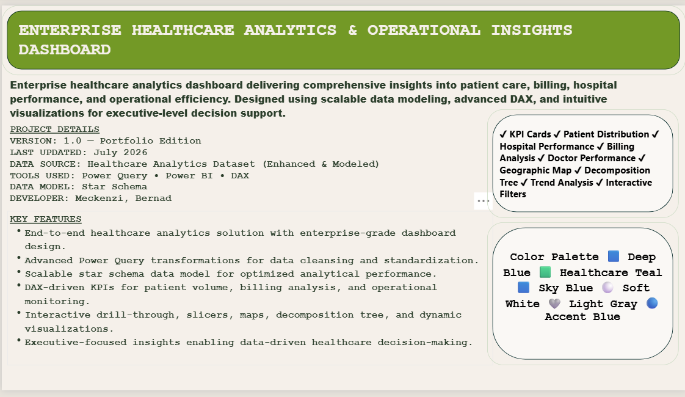
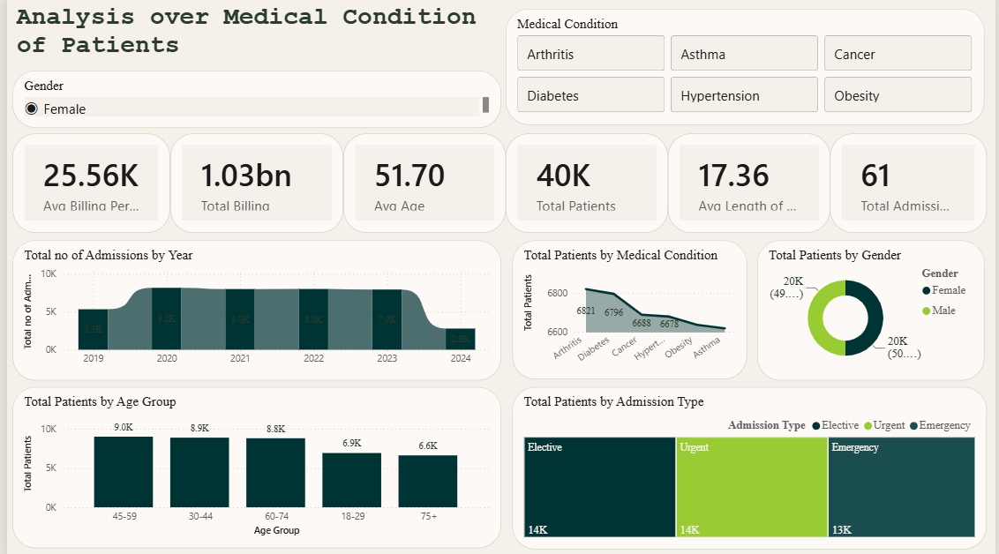
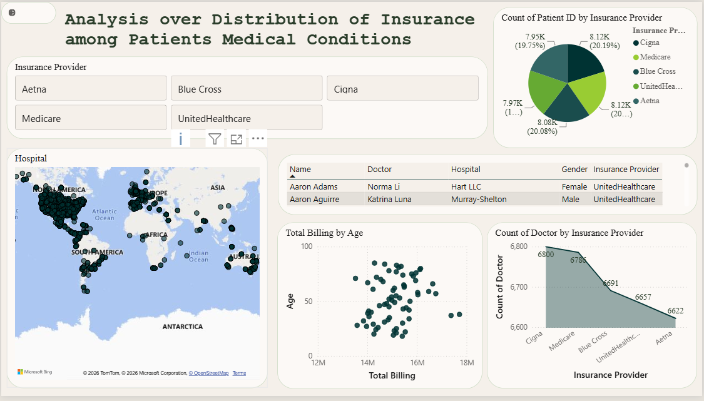
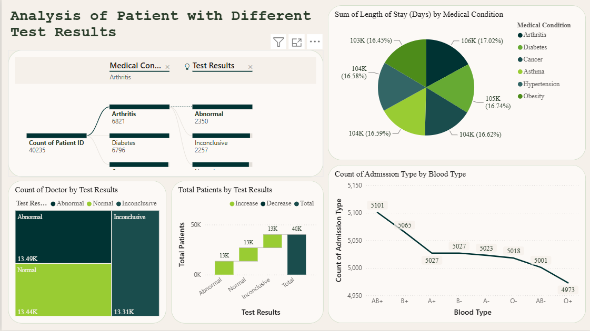
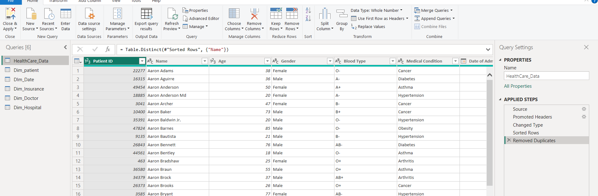
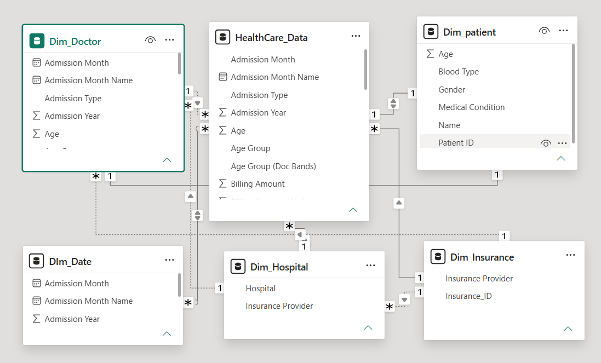

<div align="center">


# 🏥 Enterprise Healthcare Analytics Dashboard

### Turning Healthcare Data into Actionable Business Intelligence


<br>


<br>

</div>

---

# 📖 About the Project

Healthcare organizations generate large volumes of operational and financial data every day. Converting this information into meaningful insights is essential for improving patient care, resource utilization, and strategic decision-making.

The **Enterprise Healthcare Analytics Dashboard** is an end-to-end Business Intelligence solution built in **Microsoft Power BI**. It transforms raw healthcare data into interactive dashboards that help stakeholders monitor performance, identify trends, and support data-driven decisions.

---

# 🎯 Project Objectives

- Monitor healthcare KPIs in real time
- Analyze patient demographics and medical conditions
- Evaluate insurance coverage and financial performance
- Track laboratory test outcomes
- Improve operational efficiency through interactive reporting
- Enable executive-level decision making

---

# 🚨 Business Problem

Healthcare providers often face challenges such as:

- Disconnected data sources
- Manual reporting processes
- Limited visibility into patient trends
- Delayed business decisions
- Inefficient resource allocation
- Difficulty monitoring key healthcare metrics

Without a centralized reporting solution, identifying operational bottlenecks becomes time-consuming and error-prone.

---

# 💡 Business Solution

This dashboard consolidates healthcare data into a unified analytical platform using Power BI.

### Key Capabilities

- Executive KPI monitoring
- Interactive filtering and drill-down
- Patient analytics
- Insurance performance analysis
- Medical condition tracking
- Laboratory test result analysis
- Automated reporting
- Visual trend analysis

---

# 🌟 Project Highlights


| Feature | Description |
|---------|-------------|
| 📊 Interactive Dashboard | Dynamic and user-friendly reports |
| ⚡ Power Query | Data cleaning and transformation |
| 🧠 DAX Measures | Business calculations and KPIs |
| 🏥 Healthcare Analytics | Patient and operational insights |
| 📈 Executive Reporting | High-level business monitoring |
| 🔍 Drill-through Analysis | Detailed exploration of data |
| 📅 Time Intelligence | Trend analysis across time |
| 🎨 Professional UI | Enterprise-inspired dashboard design |

---

# 🛠 Tech Stack


| Category | Technology |
|----------|------------|
| Visualization | Microsoft Power BI |
| ETL | Power Query |
| Calculations | DAX |
| Data Modeling | Star Schema |
| Data Source | CSV / Excel |
| Design | Healthcare Green Theme |

---

# 📂 Dataset Overview

The dataset represents healthcare operations and includes information related to:

- Patient demographics
- Medical conditions
- Insurance providers
- Billing details
- Admission and discharge dates
- Laboratory test results
- Hospital information
- Doctors and departments

---

# 📌 Key Performance Indicators (KPIs)


| KPI | Purpose |
|-----|---------|
| 👥 Total Patients | Measure patient volume |
| 💰 Total Revenue | Financial performance |
| 🏥 Average Billing | Revenue efficiency |
| 🧪 Test Results | Laboratory outcomes |
| ❤️ Medical Conditions | Disease distribution |
| 📈 Insurance Coverage | Policy insights |

</div>

---

# 🚀 Why This Project?

> [!IMPORTANT]
> This project demonstrates practical Business Intelligence skills by combining **Power Query**, **Data Modeling**, **DAX**, and **Power BI** to solve real-world healthcare reporting challenges. It is designed to reflect enterprise reporting standards and provide meaningful insights for business stakeholders.

---

## 📍 Repository Structure

```text
Enterprise-Healthcare-Analytics-Dashboard/
│
├── assets/
│   ├── cover.png
│   ├── medical-dashboard.png
│   ├── insurance-dashboard.png
│   ├── test-results-dashboard.png
│   ├── power-query.png
│   └── star-schema.png
│
├── Dashboard/
│   └── Enterprise Healthcare Analytics.pbix
│
├── Dataset/
│
├── README.md
│
└── LICENSE
```

---

# 📊 Dashboard Preview

> [!TIP]
> The dashboard is designed to provide executives, hospital administrators, and analysts with a unified view of healthcare operations, financial performance, and patient insights.

---

# 🏠 Dashboard Overview

<div align="center">



</div>

### Overview

The landing page provides a high-level summary of the entire healthcare ecosystem, allowing decision-makers to quickly monitor performance using interactive KPIs and visual analytics.

### Highlights

- Executive KPI Cards
- Interactive Navigation
- Dynamic Filters
- Healthcare Overview
- Business Performance Summary

---

# 🩺 Medical Condition Analysis

<div align="center">



</div>

### Business Purpose

This dashboard helps healthcare professionals understand disease distribution across different patient groups and identify the most common medical conditions.

### Key Insights

- Patient distribution by medical condition
- Gender-wise disease analysis
- Age group segmentation
- Admission trends
- Disease frequency
- Comparative health insights

---

# 💳 Insurance Analysis

<div align="center">



</div>

### Business Purpose

Analyzes insurance providers and billing information to evaluate financial performance and reimbursement trends.

### Key Insights

- Revenue by insurance provider
- Billing amount analysis
- Patient coverage trends
- Provider comparison
- Financial contribution
- Insurance performance

---

# 🧪 Laboratory Test Results

<div align="center">



</div>

### Business Purpose

Tracks laboratory test outcomes and helps identify trends in diagnostic results.

### Key Insights

- Test result distribution
- Positive vs Negative cases
- Test frequency
- Patient outcome analysis
- Laboratory performance
- Healthcare quality monitoring

---

# ⚙️ Power Query (ETL Process)

<div align="center">



</div>

### Data Preparation

Power Query was used to clean, transform, and prepare the raw healthcare dataset before loading it into Power BI.

### Transformations Performed

- Removed duplicate records
- Handled missing values
- Standardized column names
- Corrected data types
- Created calculated columns
- Optimized dataset for reporting

---

# ⭐ Star Schema Data Model

<div align="center">



</div>

### Data Modeling

The dashboard follows a **Star Schema** architecture to improve performance, scalability, and report maintainability.

### Benefits

- Faster report performance
- Simplified relationships
- Better DAX calculations
- Improved scalability
- Optimized filtering
- Enterprise-ready structure

---

# 🚀 Dashboard Features

| Feature | Available |
|----------|:---------:|
| Interactive Slicers | ✅ |
| Drill Through | ✅ |
| Drill Down | ✅ |
| Cross Filtering | ✅ |
| Dynamic KPIs | ✅ |
| Tooltips | ✅ |
| Bookmarks | ✅ |
| Navigation Buttons | ✅ |
| Conditional Formatting | ✅ |
| Responsive Layout | ✅ |

---

# 📈 Business Insights Delivered

The dashboard enables stakeholders to answer critical business questions, including:

- Which medical conditions are most common?
- Which insurance provider contributes the highest revenue?
- How are laboratory test results distributed?
- Which patient groups require more attention?
- What are the major healthcare trends?
- How can operational efficiency be improved?

---

# 💼 Business Value

> [!IMPORTANT]
> This solution transforms raw healthcare data into actionable insights, enabling organizations to make faster, data-driven decisions while improving operational efficiency and patient care.

---

# 🎯 Skills Demonstrated

### Business Intelligence

- Dashboard Development
- KPI Design
- Data Storytelling
- Interactive Reporting

### Data Modeling

- Star Schema
- Relationship Modeling
- Fact & Dimension Tables

### Power BI

- Power Query
- DAX
- Visual Design
- Slicers
- Drill Through
- Bookmarks

### Analytics

- Healthcare Analytics
- Financial Analysis
- Operational Reporting
- Executive Reporting

---
---

# 🏗️ Solution Architecture

The dashboard follows a modern Business Intelligence workflow that transforms raw healthcare data into actionable insights.

```text
Healthcare Dataset
        │
        ▼
Power Query (ETL)
        │
        ▼
Data Modeling
        │
        ▼
DAX Measures
        │
        ▼
Interactive Dashboard
        │
        ▼
Business Insights
```

---

# ⭐ Data Model

The project follows a **Star Schema** design to improve report performance and simplify data relationships.

<div align="center">


</div>

### Advantages

- Fast query performance
- Simplified relationships
- Better filter propagation
- Reusable DAX measures
- Enterprise-ready architecture

---

# ⚡ DAX Highlights

A few key measures were created to support business reporting.

### Total Patients

```DAX
Total Patients =
DISTINCTCOUNT(Healthcare[Name])
```

---

### Total Billing

```DAX
Total Billing =
SUM(Healthcare[Billing Amount])
```

---

### Average Billing

```DAX
Average Billing =
AVERAGE(Healthcare[Billing Amount])
```

---

### Average Age

```DAX
Average Age =
AVERAGE(Healthcare[Age])
```

---

### Total Admissions

```DAX
Total Admissions =
COUNTROWS(Healthcare)
```

---

# 📊 Key Business Metrics

| Metric | Purpose |
|---------|---------|
| Total Patients | Patient volume |
| Total Billing | Revenue generated |
| Average Billing | Financial efficiency |
| Average Age | Demographic analysis |
| Medical Conditions | Disease monitoring |
| Insurance Providers | Coverage analysis |
| Test Results | Diagnostic insights |

---

# 💼 Business Impact

This dashboard enables healthcare organizations to:

- Monitor operational performance
- Improve executive reporting
- Track patient demographics
- Analyze insurance coverage
- Identify healthcare trends
- Support strategic decision-making

---


# 🎯 Technical Skills Demonstrated

### Data Preparation

- Data Cleaning
- Data Transformation
- Power Query ETL
- Data Validation

### Data Modeling

- Star Schema
- Relationship Management
- Fact & Dimension Design

### Business Intelligence

- Interactive Dashboards
- KPI Design
- Executive Reporting
- Data Storytelling

### Power BI

- DAX
- Power Query
- Drill Through
- Bookmarks
- Slicers
- Tooltips
- Conditional Formatting

---

# 🌟 Project Strengths

> [!NOTE]
> This project demonstrates an end-to-end Business Intelligence workflow—from raw healthcare data to executive-ready dashboards—using Microsoft Power BI and industry-standard modeling techniques.

### Highlights

- Enterprise dashboard design
- Interactive reporting experience
- Optimized data model
- Reusable DAX measures
- Business-focused KPIs
- Clean and professional UI
- Decision-support analytics

---

# 📌 Best Practices Followed

- ✅ Star Schema Modeling
- ✅ Consistent Naming Conventions
- ✅ Optimized DAX Measures
- ✅ Clean Visual Layout
- ✅ Responsive Report Design
- ✅ Reusable Components
- ✅ Business-Oriented KPIs

---
---

# 🚀 Getting Started

## Prerequisites

Before running the project, make sure you have:

- Microsoft Power BI Desktop
- Windows 10 / 11
- Git (Optional)

---

## Installation

Clone the repository:

```bash
git clone https://github.com/yourusername/Enterprise-Healthcare-Analytics-Dashboard.git
```

Open the project folder:

```bash
cd Enterprise-Healthcare-Analytics-Dashboard
```

Launch the Power BI report:

```text
Dashboard/
└── Enterprise Healthcare Analytics.pbix
```

Refresh the dataset if required.

---

# 💻 How to Use

1. Open the `.pbix` file.
2. Refresh the dataset.
3. Navigate using the report pages.
4. Apply filters and slicers.
5. Drill into visualizations.
6. Analyze KPIs and business insights.

---

# 🎯 Future Enhancements

The dashboard can be extended with additional enterprise capabilities.

- 🤖 AI-powered forecasting
- 📊 Predictive analytics
- ☁ Azure SQL Integration
- 🔄 Scheduled Refresh
- 🔐 Row-Level Security (RLS)
- 📱 Mobile Dashboard Optimization
- 🌍 Multi-Hospital Analytics
- 📈 Microsoft Fabric Integration

---

# 🏆 Project Achievements

✅ End-to-End Power BI Solution

✅ Interactive Executive Dashboard

✅ Healthcare Business Analytics

✅ Power Query ETL

✅ Star Schema Data Modeling

✅ DAX KPI Development

✅ Professional Dashboard Design

✅ Business-Oriented Reporting

---

# 📚 Skills Demonstrated

### Data Analytics

- Data Cleaning
- Data Transformation
- Data Validation
- Business Analysis

### Business Intelligence

- Dashboard Development
- KPI Reporting
- Data Storytelling
- Executive Reporting

### Power BI

- Power Query
- DAX
- Star Schema
- Relationships
- Drill Through
- Slicers
- Bookmarks
- Tooltips

---

# 🌟 Why This Project Stands Out

> [!IMPORTANT]
>
> This project demonstrates the complete Business Intelligence lifecycle—from raw healthcare data to executive-ready dashboards.
>
> It showcases practical experience in Power BI, Power Query, DAX, data modeling, and business storytelling using a real-world healthcare use case.

---

# 🤝 Connect With Me

<div align="center">

<a href="https://www.linkedin.com/in/your-linkedin">

</a>

<a href="https://github.com/yourusername">

</a>

<a href="mailto:yourmail@gmail.com">

</a>

</div>

---

# 📈 GitHub Stats

<div align="center">


</div>

---

# ⭐ Support

If you found this project useful,

⭐ Star this repository

🍴 Fork the repository

📢 Share it with your network

Your support is greatly appreciated.

---


<div align="center">

## 💚 Enterprise Healthcare Analytics Dashboard

### Transforming Healthcare Data into Actionable Intelligence


</div>
